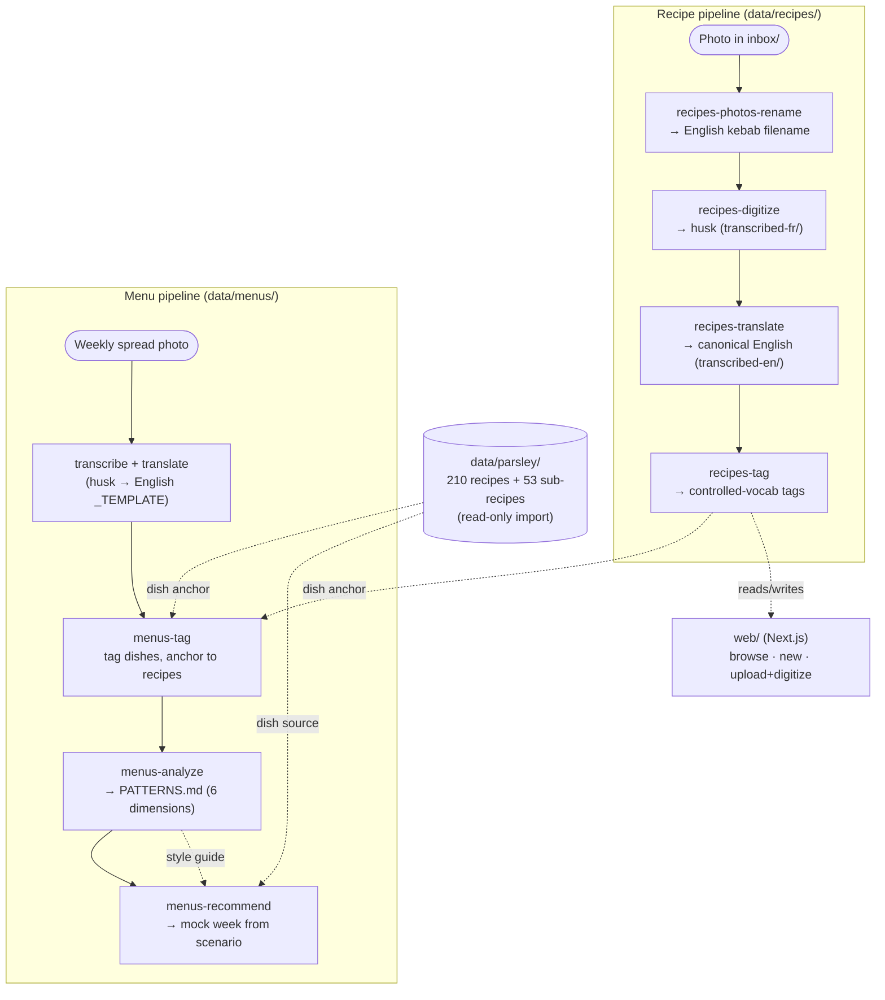

# Restaurant AI Management System

## Project Overview

### What I Built

I designed and built a **kitchen-management platform for one small independent restaurant** (a chef + a baker) that turns a binder of paper recipes and a handful of handwritten weekly menu spreads into a clean, searchable, tag-rich database — and then uses that database to *reason about the chef's style* and draft new menus in it. It is **multilingual from day one** (the kitchen works in French; the canonical database is English) and **photo-first**: the raw input is a phone photo of a recipe sheet or a menu spread, not a form someone fills in.

The system is built as two **AI skill pipelines** plus a **web front-end** over one shared source of truth — plain markdown files on disk:

- A **recipe pipeline** that walks a photo from inbox to a fully-tagged English recipe through four deliberately separated stages: rename → transcribe → translate → tag.
- A **menu pipeline** that takes weekly menu spreads through the same husk-then-promote path, then goes further: it tags every dish, distils the chef's habits into a living *patterns* document, and generates brand-new mock menus in the chef's style from a weather/holiday scenario.
- A **Next.js web app** to browse, hand-create, and digitize recipes against the very same markdown files the skills read and write.

The defining design choice is the **husk boundary**: transcription only ever copies what is literally on the sheet, and every act of *inference* (translating, tagging, interpreting the chef's intent) is a separate, later, individually-testable stage. Empty is correct; invented is a bug.

### Why I Built It

Existing tools (Parsley, Apicbase, MarketMan) get a kitchen halfway there but are built for chains and stop at ingredient cost. The gaps this project is positioned to fill — captured in [`docs/research/landscape-scan.md`](docs/research/landscape-scan.md):

- **Affordable, multilingual, photo-first onboarding** — turn a French paper binder into a structured English database for a shop of two, using a paid vision model only where OCR accuracy is worth a few cents per recipe.
- **True cost** *(moat, future)* — fold fixed costs (rent, electricity, equipment repair) into per-dish profitability, not just ingredient COGS.
- **Production-timing optimization** *(moat, future)* — sequence *when* to put what in the oven across a chef + baker sharing constrained equipment, not just *how much* to prep.

The strategy is to **capture the data hooks for the moats now** — yields, per-step durations, equipment, temperatures, a controlled-vocabulary tag taxonomy — while shipping the cheap, immediately-useful digitization and menu tooling first. See [`docs/product/roadmap.md`](docs/product/roadmap.md).

## Technical Overview

### System Architecture

The system is a set of **loosely coupled stages over markdown-on-disk**. Every stage reads files, writes files, and is independently runnable; nothing holds a database. There are five layers:

- **Recipe pipeline (Claude skills):** four skills move a photo through `data/recipes/`. Each does exactly one job and refuses the next one's job — a photo becomes a *husk* (pure transcription, original language), the husk is *promoted* to a canonical English recipe, and only then is it *tagged*. See **Key Components**.
- **Menu pipeline (Claude skills):** weekly menu spreads follow the same husk-then-promote path into `data/menus/`, then three menu skills add structure and intelligence: tag every dish (anchoring it to a real recipe), analyze all weeks into a living patterns document, and recommend new mock weeks from a scenario.
- **Parsley repertoire (`data/parsley/`):** a read-only import of the kitchen's existing Parsley cookbook — 210 recipes and 53 sub-recipes, each in English and French — scraped once via [`scripts/scrape-parsley-ingredients.mjs`](scripts/scrape-parsley-ingredients.mjs) (GET-only against Parsley's own API using a logged-in session). This is the dish repertoire the menu recommender draws from.
- **Web app (`web/`):** a Next.js 15 / React 19 app that reads and writes the same `data/` markdown files — browse the recipe database with search + status filters, hand-enter a recipe, or upload a photo and have the Claude API transcribe it in-browser. The website and the skills share one source of truth.
- **Docs + process (`docs/`):** the competitive scan and product roadmap, plus a **spec-driven-development** trail — every skill has a design spec and an implementation plan under `docs/superpowers/` before it was built.

### Key Components

**Recipe pipeline — four single-purpose skills (`.claude/skills/recipes-*`):**

- **`recipes-photos-rename`** — reads each photo in `data/recipes/inbox/` and renames it in place to a kebab-case **English** name derived from the recipe title (translating the title when needed). Naming only; it never creates recipe files.
- **`recipes-digitize`** — transcribes each inbox photo into a content-only **husk** in the sheet's *original* language (`data/recipes/processed/transcribed-fr/`), matching `_TEMPLATE_HUSK.md`, and moves the photo to `processed/photos/`. Pure transcription — no translation, no tags, no status inference. Flags anything illegible, ambiguous, or cut off with a note written *to the person who will fix it*.
- **`recipes-translate`** — translates a husk into the **canonical English** recipe (`data/recipes/processed/transcribed-en/`), promoting it to the full `_TEMPLATE.md` schema (adds `status`, blank metadata). Translation only; it does not infer tags.
- **`recipes-tag`** — the inference step the earlier stages deliberately skip: reads a recipe's ingredients + instructions and fills the **controlled-vocabulary tag block** (protein, course, temperature, spice, richness, diet, allergens, cuisine, …), choosing only from the allowed values in `_TEMPLATE.md` or leaving a field blank.

**Menu pipeline — three skills (`.claude/skills/menus-*`):**

- **`menus-tag`** — for every unique dish in a week's pool + schedule, anchors the dish to a recipe (the tagged `transcribed-en` recipe if one exists, else the Parsley repertoire) and infers a core tag set (protein, temperature, richness, format, cuisine, spice, diet). The menu analogue of `recipes-tag`; it never interprets the chef's reasoning.
- **`menus-analyze`** — reads every tagged week and regenerates the living document [`data/menus/PATTERNS.md`](data/menus/PATTERNS.md), deriving **six dimensions** — menu skeleton, dish rotation, per-day balance, weather/temperature tendencies, calendar/holiday behavior, and a verbatim stated-intent log — each pattern carrying **support / confidence / source** so a small, partly-inferred sample stays honest. Produces patterns, never recommendations, and never edits the menus.
- **`menus-recommend`** — the consumer end of the pipeline: given a scenario (weather, temperatures, day-of-week, holidays — supplied or invented), it drafts a **mock weekly menu** in the chef's style, drawing dishes from the Parsley repertoire and guided by `PATTERNS.md`, then explains *why* it composed the week that way. Writes a clearly-flagged `status: mock` file under `data/menus/generated/`; never touches real menus, recipes, or the patterns doc.

**The controlled-vocabulary tag taxonomy (`data/recipes/_TEMPLATE.md`):** the schema that makes menu planning possible. Single-value axes (temperature, weight, season, course, protein, cooking_method, spice_level, richness, format) and multi-value axes (diet, texture, flavor_profile), plus first-class **allergens** for safety, and true-cost/timing hooks (yields, prep time, per-step durations, equipment, temps) reserved for the future moats. `cuisine` is the one open list; everything else is a fixed vocabulary the tagging skills must pick from.

**Web app (`web/`):** a Next.js app (see [`web/README.md`](web/README.md)) that reads the recipe markdown straight off disk (`web/lib/recipes.ts`) and offers three surfaces — **Browse** (`/`, every recipe with search + status filters), **New recipe** (`/new`, a manual entry form saved as verified), and **Upload photo** (`/upload`, which drops the image in the inbox and calls the Claude vision API to name + transcribe it, routing clean reads to draft and ambiguous ones to flagged). The Anthropic key (used only for Upload) lives in a gitignored repo-root `.env`.

### Data Model & the Husk Boundary

Two template pairs anchor the whole system, and both encode the same rule:

- **Recipes:** `_TEMPLATE_HUSK.md` (pure transcription, original language, content only, *no* status/tags/cost) → `_TEMPLATE.md` (canonical English, controlled-vocab tags, allergens, yields, lifecycle `status`).
- **Menus:** `_TEMPLATE_HUSK.md` → `_TEMPLATE.md` for one weekly spread (left-page dish **pool** by fixed category + right-page daily **schedule** with weather/temperature/notes).

`status:` is the **sole** record of lifecycle (`draft | flagged | verified | archived | mock`) — there are no status folders. The COGS/cost sticky note on the menu spread is *intentionally* never transcribed. This is the core discipline: magnitudes and structure come from what is literally on the sheet; interpretation is always a separate, auditable stage.

## Code in Action: Recipe → Tagged Menu

### 1. A photo becomes a husk — transcription only (`recipes-digitize`)

```text
data/recipes/inbox/cardamom-chicken.jpg
  → data/recipes/processed/transcribed-fr/cardamom-chicken.md   # husk, original language
  → data/recipes/processed/photos/cardamom-chicken.jpg          # photo filed
```

### 2. The husk is promoted to a canonical English recipe (`recipes-translate`)

```text
data/recipes/processed/transcribed-en/cardamom-chicken.md       # full _TEMPLATE.md schema, status: draft
```

### 3. Tags are inferred from ingredients + instructions (`recipes-tag`)

```yaml
tags:
  temperature: hot
  protein: chicken
  spice_level: mild
  richness: moderate
  cuisine: indian
allergens: [dairy]
```

### 4. A mock week is drafted in the chef's style (`menus-recommend`)

```yaml
id: mock-hot-sunny-week
status: mock
scenario:
  given: "hot sunny week (high-20s to low-30s °C), Tuesday is a statutory holiday (closed)"
pool:
  poisson: ["Salmon pesto", "Moqueca", "Salmon Cajun sandwich"]
  potage:  ["Potage Froid Mélonccio", "Potage Crème de tomates", "Tulum"]
```

_(A cold **potage** leads a hot-sunny week; Tuesday is dropped for the holiday — both traceable to patterns in `PATTERNS.md`.)_

## How the Workflow Runs

Two pipelines share the husk-then-promote spine. Everything is files on disk; each stage is one skill.



**1. Rename, then transcribe (recipe pipeline)**

```text
python-free: run each skill on the folder
recipes-photos-rename   # inbox/*.jpg → english-name.jpg
recipes-digitize        # → transcribed-fr/*.md (husk) + file the photo
```

**2. Promote and tag**

```text
recipes-translate       # husk → transcribed-en/*.md (canonical English)
recipes-tag             # fill the controlled-vocabulary tag block
```

**3. Tag menus, distil patterns, recommend**

```text
menus-tag               # anchor every dish to a recipe / Parsley entry
menus-analyze           # regenerate data/menus/PATTERNS.md
menus-recommend         # draft a mock week for a given/invented scenario
```

**4. Browse and digitize in the web app**

```sh
cd web && npm install && npm run dev   # http://localhost:3000
# Browse (/), New recipe (/new), Upload photo (/upload → Claude vision → draft/flagged)
```

## Project Structure & File Guide

```text
restaurant_project/
│
├── README.md                    # This file
├── HOURS.md                     # Work log
│
├── .claude/skills/              # The pipeline — one skill per stage
│   ├── recipes-photos-rename/   # inbox photo → English kebab filename
│   ├── recipes-digitize/        # photo → original-language husk (transcription only)
│   ├── recipes-translate/       # husk → canonical English recipe
│   ├── recipes-tag/             # infer controlled-vocabulary tags
│   ├── menus-tag/               # tag menu dishes, anchor each to a recipe
│   ├── menus-analyze/           # regenerate PATTERNS.md (living document)
│   └── menus-recommend/         # draft a mock week in the chef's style
│
├── data/                        # The single source of truth — markdown on disk
│   ├── recipes/
│   │   ├── _TEMPLATE.md          # canonical schema: controlled-vocab tags, allergens, cost/timing hooks
│   │   ├── _TEMPLATE_HUSK.md     # transcription-only schema (no tags/status/cost)
│   │   ├── inbox/                # photos waiting to be digitized
│   │   └── processed/            # transcribed-fr/ (husks) · transcribed-en/ (canonical) · photos/
│   ├── menus/
│   │   ├── _TEMPLATE.md          # canonical weekly spread: dish pool + daily schedule
│   │   ├── _TEMPLATE_HUSK.md     # transcription-only weekly spread
│   │   ├── PATTERNS.md           # living patterns doc (6 weeks analyzed, support/confidence/source)
│   │   ├── processed/            # transcribed-fr/ · transcribed-en/ · photos/  (6 weeks)
│   │   └── generated/            # mock weeks from menus-recommend (status: mock)
│   └── parsley/                  # read-only Parsley import: recipes-en/fr (210) + sub-recipes-en/fr (53)
│
├── scripts/
│   └── scrape-parsley-ingredients.mjs   # GET-only Parsley export → data/parsley/
│
├── web/                         # Next.js 15 / React 19 app over the same data/ files
│   ├── app/                     # / (browse) · /new · /upload · /recipes/[id] · /api/*
│   ├── lib/                     # recipes.ts (read) · writeRecipe.ts · pipeline.ts (Claude vision) · paths.ts
│   ├── components/              # RecipeBrowser, StatusPill
│   └── README.md                # run / env / deploy notes
│
└── docs/
    ├── research/landscape-scan.md   # competitive analysis (the two moats)
    ├── product/roadmap.md           # phased plan + open questions
    └── superpowers/                 # spec-driven-development trail (specs/ + plans/ per skill)
```

## Current Status

The digitization and menu tooling is **working end-to-end**, on a real (small) corpus:

- **7 recipes** carried through the full pipeline — husk (`transcribed-fr`) → canonical English (`transcribed-en`) → tagged, with the source photo filed alongside.
- **6 real weekly menus** (May 11 – June 15 2026) transcribed, translated, and tagged; all `flagged` because they come from hard-to-read handwritten spreads — the flag notes say exactly what is unclear.
- **`PATTERNS.md`** regenerated from those 6 weeks across all six dimensions, with an explicit **sample caveat** and per-pattern support/confidence/source (most tags inferred, not chef-stated; late-spring window only).
- **5 mock weeks** generated across varied scenarios (hot-sunny, cool-rainy, cold-snap, autumn, mild-spring), each `status: mock`, each with a written rationale traceable to the patterns doc.
- **Parsley repertoire imported** read-only: 210 recipes + 53 sub-recipes in both English and French.
- **Web app** runs locally — browse with search + status filters, manual create, and photo upload + in-browser Claude digitization to draft/flagged.
- **Every skill** shipped through spec-driven development: a design spec and an implementation plan under `docs/superpowers/` precede each build.

The two **moats — true cost and production-timing optimization — are future work**; their data hooks already live in `_TEMPLATE.md` so they're cheap to reach and expensive to retrofit.

## Challenges and How I Solved Them

- **Keeping transcription honest (the husk boundary):** vision models love to "helpfully" infer allergens, tags, and quantities that aren't on the sheet. Solved by splitting the pipeline so digitize/translate *only copy what's printed* and write a content-only husk; all inference (tags, dish anchoring, patterns) is a strictly later stage. An empty field is correct; an invented one is a bug.
- **A small, messy, partly-inferred sample:** the real menus are 6 flagged weeks of handwriting with `?` dish names and weather legible on only 4. Rather than pretend to certainty, `menus-analyze` attaches **support / confidence / source** to every pattern and a blunt sample caveat at the top of `PATTERNS.md`, so downstream recommendations treat weak signals as hypotheses, not facts.
- **A controlled vocabulary that stays consistent across runs:** free-text tags would make menu planning impossible. `_TEMPLATE.md` pins a fixed allowed-value list per axis and the tagging skills must pick from it (or leave it blank) — with `cuisine` the single deliberately-open list, because food can come from anywhere.
- **One source of truth for skills and web app:** the website and the AI skills must never diverge. Both read and write the same `data/` markdown; `web/lib/paths.ts` resolves the repo-root `data/` folder (overridable via `RECIPE_DATA_DIR`) so there's exactly one database.
- **Importing Parsley without risking the live cookbook:** the scrape script performs **only** authenticated HTTP GETs against Parsley's own API — it never saves, edits, or deletes — and writes plain ingredient markdown, giving the recommender a rich repertoire with zero write risk.

## Future Possibilities

- **True-cost dashboard** — allocate fixed costs (rent, power, repair) into per-dish profit; the yield + cost hooks already exist in `_TEMPLATE.md`.
- **Production-timing optimizer** — sequence the oven across chef + baker once per-step durations, equipment, and temps are populated (the eventual showpiece).
- **Stock/season-aware weekly menu *suggestions*** — the rules + tags + stock-list version of `menus-recommend`, no POS data required.
- **Deeper corpus** — more real weeks (all four seasons) to move `PATTERNS.md` off a late-spring-only window and raise confidence.
- **Deployment** — data is files on disk, so a host with a persistent volume (e.g. Railway) fits; point `RECIPE_DATA_DIR` at the volume. Vercel's ephemeral filesystem can't persist new recipe files without moving storage to a DB/object store.

## TL;DR

A photo-first, multilingual kitchen platform for one small restaurant: AI skill pipelines turn French paper recipes and handwritten weekly menus into a clean, controlled-vocabulary English database, then distil the chef's habits into a living patterns document and draft new mock menus in the chef's style — all over plain markdown files, with a strict boundary between *transcribing what's on the sheet* and *inferring anything*, plus a Next.js app to browse and digitize against the same data. True-cost and oven-timing analytics are the reserved moats, their data hooks captured from day one.

---

**Project Duration:** June 2026 – Present
**Technologies:** Claude (Agent skills + vision API), Next.js 15, React 19, TypeScript, Tailwind CSS, `@anthropic-ai/sdk`, gray-matter / YAML, Node.js, Markdown-on-disk, Git
